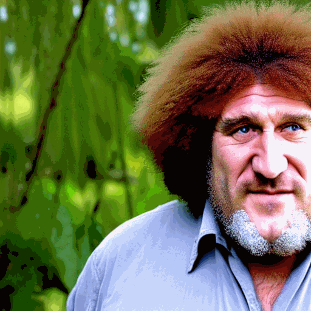
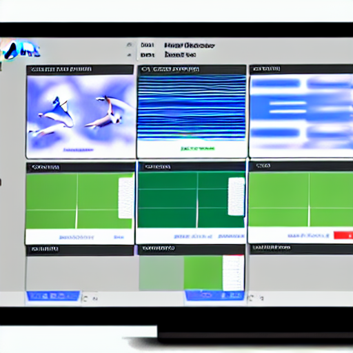
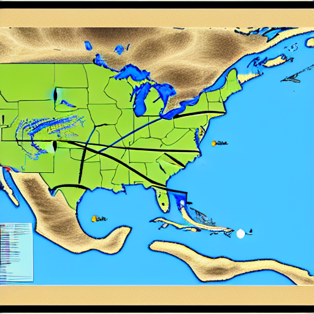
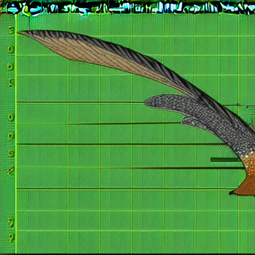

::: {.cell}
<style type="text/css">
/* Browser font: Lato */
/* Browser font-size: 13.5pt or 18px */
/* Browser font-color: #212529 */
/* Browser line-height: 1.5 */

/* Banner color */
.quarto-title-banner {
  background: #2c3e50;
}

/* Lower the margin around h2 */
h2, .h2 {
  margin-top: 1rem;
  margin-bottom: 1rem;
}

/* Remove margin at the top of main text */
main {
  margin-top: 0em;
}

/* Adapt line height close (1.3) to the one of browser (1.5)*/
p {
  line-height: 1.3 !important;
}

/* Right align */
.right-align {
  text-align: right;
}

/* Remove margin at the bottom of title */
#title-block-header {
  margin-block-end: 0rem;
}

/* Remove meta data information (e.g. Date) */
#title-block-header.quarto-title-block.default .quarto-title-meta {
  display: none;
}

/* Remove toc-title */
#toc-title {
  display: none;
}

/* Remove references title */
#references {
  display: none;
}

/* Remove line of automatic reference section */
#quarto-appendix.default {
  padding-top: 0em;
  margin-top: 0em;
  border-top: 0px solid #dee2e6;
}

/* border for figures in Software section */
.fig-software {
  border: #dee2e6 1px solid;
}
</style>
:::

::: {.cell}

:::


::: {.column-margin .right-align}
{#pp}

gerard.pastufle@domain-name.net

00-000-000-00

[Google Scholar](https://scholar.google.com/)

[GitHub](https://github.com/)

[ResearchGate](https://www.researchgate.net/)
:::

## Professional Experience


::: {.cell}
::: {.cell-output-display}

```{=html}
<div class="tabwid"><style>.cl-c22a17b4{table-layout:auto;width:100%;}.cl-c21afc84{font-family:'Lato';font-size:14pt;font-weight:bold;font-style:normal;text-decoration:none;color:rgba(33, 37, 41, 1.00);background-color:transparent;}.cl-c21afc85{font-family:'Lato';font-size:14pt;font-weight:normal;font-style:normal;text-decoration:none;color:rgba(33, 37, 41, 1.00);background-color:transparent;}.cl-c21afc86{font-family:'Lato';font-size:14pt;font-weight:normal;font-style:italic;text-decoration:none;color:rgba(33, 37, 41, 1.00);background-color:transparent;}.cl-c21afc87{font-family:'Lato';font-size:13.5pt;font-weight:normal;font-style:normal;text-decoration:none;color:rgba(33, 37, 41, 1.00);background-color:transparent;}.cl-c221b344{margin:0;text-align:left;border-bottom: 0 solid rgba(0, 0, 0, 1.00);border-top: 0 solid rgba(0, 0, 0, 1.00);border-left: 0 solid rgba(0, 0, 0, 1.00);border-right: 0 solid rgba(0, 0, 0, 1.00);padding-bottom:1pt;padding-top:1pt;padding-left:1pt;padding-right:1pt;line-height: 1;background-color:transparent;}.cl-c221b345{margin:0;text-align:right;border-bottom: 0 solid rgba(0, 0, 0, 1.00);border-top: 0 solid rgba(0, 0, 0, 1.00);border-left: 0 solid rgba(0, 0, 0, 1.00);border-right: 0 solid rgba(0, 0, 0, 1.00);padding-bottom:1pt;padding-top:1pt;padding-left:1pt;padding-right:1pt;line-height: 1;background-color:transparent;}.cl-c221b346{margin:0;text-align:left;border-bottom: 0 solid rgba(0, 0, 0, 1.00);border-top: 0 solid rgba(0, 0, 0, 1.00);border-left: 0 solid rgba(0, 0, 0, 1.00);border-right: 0 solid rgba(0, 0, 0, 1.00);padding-bottom:10pt;padding-top:1pt;padding-left:1pt;padding-right:1pt;line-height: 1;background-color:transparent;}.cl-c221b347{margin:0;text-align:right;border-bottom: 0 solid rgba(0, 0, 0, 1.00);border-top: 0 solid rgba(0, 0, 0, 1.00);border-left: 0 solid rgba(0, 0, 0, 1.00);border-right: 0 solid rgba(0, 0, 0, 1.00);padding-bottom:10pt;padding-top:1pt;padding-left:1pt;padding-right:1pt;line-height: 1;background-color:transparent;}.cl-c221da54{background-color:transparent;vertical-align: middle;border-bottom: 0 solid rgba(0, 0, 0, 1.00);border-top: 0 solid rgba(0, 0, 0, 1.00);border-left: 0 solid rgba(0, 0, 0, 1.00);border-right: 0 solid rgba(0, 0, 0, 1.00);margin-bottom:0;margin-top:0;margin-left:0;margin-right:0;}.cl-c221da55{background-color:transparent;vertical-align: middle;border-bottom: 0 solid rgba(0, 0, 0, 1.00);border-top: 0 solid rgba(0, 0, 0, 1.00);border-left: 0 solid rgba(0, 0, 0, 1.00);border-right: 0 solid rgba(0, 0, 0, 1.00);margin-bottom:0;margin-top:0;margin-left:0;margin-right:0;}</style><table data-quarto-disable-processing='true' class='cl-c22a17b4'><thead><tr style="overflow-wrap:break-word;"><th class="cl-c221da54"><p class="cl-c221b344"><span class="cl-c21afc84">Natural History Museum</span></p></th><th class="cl-c221da55"><p class="cl-c221b345"><span class="cl-c21afc85">2019 – present</span></p></th></tr><tr style="overflow-wrap:break-word;"><th class="cl-c221da54"><p class="cl-c221b346"><span class="cl-c21afc86">Lead Scientist</span></p></th><th class="cl-c221da55"><p class="cl-c221b347"><span class="cl-c21afc86">Paris (France)</span></p></th></tr></thead><tbody><tr style="overflow-wrap:break-word;"><td  colspan="2"class="cl-c221da54"><p class="cl-c221b344"><span class="cl-c21afc87">- Oversees the museum's scientific research program and manages a team of researchers and curators</span></p></td></tr><tr style="overflow-wrap:break-word;"><td  colspan="2"class="cl-c221da54"><p class="cl-c221b344"><span class="cl-c21afc87">- Conducts research on the evolution and ecology of birds and other vertebrates</span></p></td></tr><tr style="overflow-wrap:break-word;"><td  colspan="2"class="cl-c221da54"><p class="cl-c221b344"><span class="cl-c21afc87">- Collaborates with other museums and institutions to study and document biodiversity in different regions of the world</span></p></td></tr><tr style="overflow-wrap:break-word;"><td  colspan="2"class="cl-c221da54"><p class="cl-c221b344"><span class="cl-c21afc87"></span></p></td></tr></tbody></table></div>
```

:::
:::

::: {.cell}
::: {.cell-output-display}

```{=html}
<div class="tabwid"><style>.cl-c253e878{table-layout:auto;width:100%;}.cl-c24590a2{font-family:'Lato';font-size:14pt;font-weight:bold;font-style:normal;text-decoration:none;color:rgba(33, 37, 41, 1.00);background-color:transparent;}.cl-c24590a3{font-family:'Lato';font-size:14pt;font-weight:normal;font-style:normal;text-decoration:none;color:rgba(33, 37, 41, 1.00);background-color:transparent;}.cl-c24590a4{font-family:'Lato';font-size:14pt;font-weight:normal;font-style:italic;text-decoration:none;color:rgba(33, 37, 41, 1.00);background-color:transparent;}.cl-c24590a5{font-family:'Lato';font-size:13.5pt;font-weight:normal;font-style:normal;text-decoration:none;color:rgba(33, 37, 41, 1.00);background-color:transparent;}.cl-c24b35e8{margin:0;text-align:left;border-bottom: 0 solid rgba(0, 0, 0, 1.00);border-top: 0 solid rgba(0, 0, 0, 1.00);border-left: 0 solid rgba(0, 0, 0, 1.00);border-right: 0 solid rgba(0, 0, 0, 1.00);padding-bottom:1pt;padding-top:1pt;padding-left:1pt;padding-right:1pt;line-height: 1;background-color:transparent;}.cl-c24b35e9{margin:0;text-align:right;border-bottom: 0 solid rgba(0, 0, 0, 1.00);border-top: 0 solid rgba(0, 0, 0, 1.00);border-left: 0 solid rgba(0, 0, 0, 1.00);border-right: 0 solid rgba(0, 0, 0, 1.00);padding-bottom:1pt;padding-top:1pt;padding-left:1pt;padding-right:1pt;line-height: 1;background-color:transparent;}.cl-c24b35ea{margin:0;text-align:left;border-bottom: 0 solid rgba(0, 0, 0, 1.00);border-top: 0 solid rgba(0, 0, 0, 1.00);border-left: 0 solid rgba(0, 0, 0, 1.00);border-right: 0 solid rgba(0, 0, 0, 1.00);padding-bottom:10pt;padding-top:1pt;padding-left:1pt;padding-right:1pt;line-height: 1;background-color:transparent;}.cl-c24b35eb{margin:0;text-align:right;border-bottom: 0 solid rgba(0, 0, 0, 1.00);border-top: 0 solid rgba(0, 0, 0, 1.00);border-left: 0 solid rgba(0, 0, 0, 1.00);border-right: 0 solid rgba(0, 0, 0, 1.00);padding-bottom:10pt;padding-top:1pt;padding-left:1pt;padding-right:1pt;line-height: 1;background-color:transparent;}.cl-c24b5d0c{background-color:transparent;vertical-align: middle;border-bottom: 0 solid rgba(0, 0, 0, 1.00);border-top: 0 solid rgba(0, 0, 0, 1.00);border-left: 0 solid rgba(0, 0, 0, 1.00);border-right: 0 solid rgba(0, 0, 0, 1.00);margin-bottom:0;margin-top:0;margin-left:0;margin-right:0;}.cl-c24b5d0d{background-color:transparent;vertical-align: middle;border-bottom: 0 solid rgba(0, 0, 0, 1.00);border-top: 0 solid rgba(0, 0, 0, 1.00);border-left: 0 solid rgba(0, 0, 0, 1.00);border-right: 0 solid rgba(0, 0, 0, 1.00);margin-bottom:0;margin-top:0;margin-left:0;margin-right:0;}</style><table data-quarto-disable-processing='true' class='cl-c253e878'><thead><tr style="overflow-wrap:break-word;"><th class="cl-c24b5d0c"><p class="cl-c24b35e8"><span class="cl-c24590a2">Smithsonian Institution</span></p></th><th class="cl-c24b5d0d"><p class="cl-c24b35e9"><span class="cl-c24590a3">2017 – 2019</span></p></th></tr><tr style="overflow-wrap:break-word;"><th class="cl-c24b5d0c"><p class="cl-c24b35ea"><span class="cl-c24590a4">Research Scientist</span></p></th><th class="cl-c24b5d0d"><p class="cl-c24b35eb"><span class="cl-c24590a4">Washington, D.C. (USA)</span></p></th></tr></thead><tbody><tr style="overflow-wrap:break-word;"><td  colspan="2"class="cl-c24b5d0c"><p class="cl-c24b35e8"><span class="cl-c24590a5">- Conducted research on the evolutionary history and biogeography of South American primates using molecular and morphological data</span></p></td></tr><tr style="overflow-wrap:break-word;"><td  colspan="2"class="cl-c24b5d0c"><p class="cl-c24b35e8"><span class="cl-c24590a5">- Developed new methods for analyzing and interpreting genomic data in primates</span></p></td></tr><tr style="overflow-wrap:break-word;"><td  colspan="2"class="cl-c24b5d0c"><p class="cl-c24b35e8"><span class="cl-c24590a5">- Collaborated with other researchers to study the behavior and ecology of primates in their natural habitats</span></p></td></tr><tr style="overflow-wrap:break-word;"><td  colspan="2"class="cl-c24b5d0c"><p class="cl-c24b35e8"><span class="cl-c24590a5"></span></p></td></tr></tbody></table></div>
```

:::
:::

::: {.cell}
::: {.cell-output-display}

```{=html}
<div class="tabwid"><style>.cl-c27f3e24{table-layout:auto;width:100%;}.cl-c271f7b4{font-family:'Lato';font-size:14pt;font-weight:bold;font-style:normal;text-decoration:none;color:rgba(33, 37, 41, 1.00);background-color:transparent;}.cl-c271f7b5{font-family:'Lato';font-size:14pt;font-weight:normal;font-style:normal;text-decoration:none;color:rgba(33, 37, 41, 1.00);background-color:transparent;}.cl-c271f7b6{font-family:'Lato';font-size:14pt;font-weight:normal;font-style:italic;text-decoration:none;color:rgba(33, 37, 41, 1.00);background-color:transparent;}.cl-c271f7b7{font-family:'Lato';font-size:13.5pt;font-weight:normal;font-style:normal;text-decoration:none;color:rgba(33, 37, 41, 1.00);background-color:transparent;}.cl-c2777608{margin:0;text-align:left;border-bottom: 0 solid rgba(0, 0, 0, 1.00);border-top: 0 solid rgba(0, 0, 0, 1.00);border-left: 0 solid rgba(0, 0, 0, 1.00);border-right: 0 solid rgba(0, 0, 0, 1.00);padding-bottom:1pt;padding-top:1pt;padding-left:1pt;padding-right:1pt;line-height: 1;background-color:transparent;}.cl-c2777609{margin:0;text-align:right;border-bottom: 0 solid rgba(0, 0, 0, 1.00);border-top: 0 solid rgba(0, 0, 0, 1.00);border-left: 0 solid rgba(0, 0, 0, 1.00);border-right: 0 solid rgba(0, 0, 0, 1.00);padding-bottom:1pt;padding-top:1pt;padding-left:1pt;padding-right:1pt;line-height: 1;background-color:transparent;}.cl-c277760a{margin:0;text-align:left;border-bottom: 0 solid rgba(0, 0, 0, 1.00);border-top: 0 solid rgba(0, 0, 0, 1.00);border-left: 0 solid rgba(0, 0, 0, 1.00);border-right: 0 solid rgba(0, 0, 0, 1.00);padding-bottom:10pt;padding-top:1pt;padding-left:1pt;padding-right:1pt;line-height: 1;background-color:transparent;}.cl-c277760b{margin:0;text-align:right;border-bottom: 0 solid rgba(0, 0, 0, 1.00);border-top: 0 solid rgba(0, 0, 0, 1.00);border-left: 0 solid rgba(0, 0, 0, 1.00);border-right: 0 solid rgba(0, 0, 0, 1.00);padding-bottom:10pt;padding-top:1pt;padding-left:1pt;padding-right:1pt;line-height: 1;background-color:transparent;}.cl-c2779d18{background-color:transparent;vertical-align: middle;border-bottom: 0 solid rgba(0, 0, 0, 1.00);border-top: 0 solid rgba(0, 0, 0, 1.00);border-left: 0 solid rgba(0, 0, 0, 1.00);border-right: 0 solid rgba(0, 0, 0, 1.00);margin-bottom:0;margin-top:0;margin-left:0;margin-right:0;}.cl-c2779d19{background-color:transparent;vertical-align: middle;border-bottom: 0 solid rgba(0, 0, 0, 1.00);border-top: 0 solid rgba(0, 0, 0, 1.00);border-left: 0 solid rgba(0, 0, 0, 1.00);border-right: 0 solid rgba(0, 0, 0, 1.00);margin-bottom:0;margin-top:0;margin-left:0;margin-right:0;}</style><table data-quarto-disable-processing='true' class='cl-c27f3e24'><thead><tr style="overflow-wrap:break-word;"><th class="cl-c2779d18"><p class="cl-c2777608"><span class="cl-c271f7b4">Max Planck Institute for Evolutionary Anthropology</span></p></th><th class="cl-c2779d19"><p class="cl-c2777609"><span class="cl-c271f7b5">2013 – 2017</span></p></th></tr><tr style="overflow-wrap:break-word;"><th class="cl-c2779d18"><p class="cl-c277760a"><span class="cl-c271f7b6">Postdoctoral Researcher</span></p></th><th class="cl-c2779d19"><p class="cl-c277760b"><span class="cl-c271f7b6">Leipzig (Germany)</span></p></th></tr></thead><tbody><tr style="overflow-wrap:break-word;"><td  colspan="2"class="cl-c2779d18"><p class="cl-c2777608"><span class="cl-c271f7b7">- Conducted research on the genomic basis of craniofacial diversity in humans and non-human primates</span></p></td></tr><tr style="overflow-wrap:break-word;"><td  colspan="2"class="cl-c2779d18"><p class="cl-c2777608"><span class="cl-c271f7b7">- Used comparative genomics to study the evolution of human-specific traits such as language and brain development</span></p></td></tr><tr style="overflow-wrap:break-word;"><td  colspan="2"class="cl-c2779d18"><p class="cl-c2777608"><span class="cl-c271f7b7">- Developed new methods for analyzing and interpreting genomic data in primates and other animals</span></p></td></tr><tr style="overflow-wrap:break-word;"><td  colspan="2"class="cl-c2779d18"><p class="cl-c2777608"><span class="cl-c271f7b7"></span></p></td></tr></tbody></table></div>
```

:::
:::

::: {.cell}
::: {.cell-output-display}

```{=html}
<div class="tabwid"><style>.cl-c2a822e4{table-layout:auto;width:100%;}.cl-c299c9ce{font-family:'Lato';font-size:14pt;font-weight:bold;font-style:normal;text-decoration:none;color:rgba(33, 37, 41, 1.00);background-color:transparent;}.cl-c299c9cf{font-family:'Lato';font-size:14pt;font-weight:normal;font-style:normal;text-decoration:none;color:rgba(33, 37, 41, 1.00);background-color:transparent;}.cl-c299c9d0{font-family:'Lato';font-size:14pt;font-weight:normal;font-style:italic;text-decoration:none;color:rgba(33, 37, 41, 1.00);background-color:transparent;}.cl-c299c9d1{font-family:'Lato';font-size:13.5pt;font-weight:normal;font-style:normal;text-decoration:none;color:rgba(33, 37, 41, 1.00);background-color:transparent;}.cl-c29f9606{margin:0;text-align:left;border-bottom: 0 solid rgba(0, 0, 0, 1.00);border-top: 0 solid rgba(0, 0, 0, 1.00);border-left: 0 solid rgba(0, 0, 0, 1.00);border-right: 0 solid rgba(0, 0, 0, 1.00);padding-bottom:1pt;padding-top:1pt;padding-left:1pt;padding-right:1pt;line-height: 1;background-color:transparent;}.cl-c29f9607{margin:0;text-align:right;border-bottom: 0 solid rgba(0, 0, 0, 1.00);border-top: 0 solid rgba(0, 0, 0, 1.00);border-left: 0 solid rgba(0, 0, 0, 1.00);border-right: 0 solid rgba(0, 0, 0, 1.00);padding-bottom:1pt;padding-top:1pt;padding-left:1pt;padding-right:1pt;line-height: 1;background-color:transparent;}.cl-c29f9608{margin:0;text-align:left;border-bottom: 0 solid rgba(0, 0, 0, 1.00);border-top: 0 solid rgba(0, 0, 0, 1.00);border-left: 0 solid rgba(0, 0, 0, 1.00);border-right: 0 solid rgba(0, 0, 0, 1.00);padding-bottom:10pt;padding-top:1pt;padding-left:1pt;padding-right:1pt;line-height: 1;background-color:transparent;}.cl-c29f9609{margin:0;text-align:right;border-bottom: 0 solid rgba(0, 0, 0, 1.00);border-top: 0 solid rgba(0, 0, 0, 1.00);border-left: 0 solid rgba(0, 0, 0, 1.00);border-right: 0 solid rgba(0, 0, 0, 1.00);padding-bottom:10pt;padding-top:1pt;padding-left:1pt;padding-right:1pt;line-height: 1;background-color:transparent;}.cl-c29fe66a{background-color:transparent;vertical-align: middle;border-bottom: 0 solid rgba(0, 0, 0, 1.00);border-top: 0 solid rgba(0, 0, 0, 1.00);border-left: 0 solid rgba(0, 0, 0, 1.00);border-right: 0 solid rgba(0, 0, 0, 1.00);margin-bottom:0;margin-top:0;margin-left:0;margin-right:0;}.cl-c29fe66b{background-color:transparent;vertical-align: middle;border-bottom: 0 solid rgba(0, 0, 0, 1.00);border-top: 0 solid rgba(0, 0, 0, 1.00);border-left: 0 solid rgba(0, 0, 0, 1.00);border-right: 0 solid rgba(0, 0, 0, 1.00);margin-bottom:0;margin-top:0;margin-left:0;margin-right:0;}</style><table data-quarto-disable-processing='true' class='cl-c2a822e4'><thead><tr style="overflow-wrap:break-word;"><th class="cl-c29fe66a"><p class="cl-c29f9606"><span class="cl-c299c9ce">Department of Ecology and Evolutionary Biology, University of California</span></p></th><th class="cl-c29fe66b"><p class="cl-c29f9607"><span class="cl-c299c9cf">2008 – 2013</span></p></th></tr><tr style="overflow-wrap:break-word;"><th class="cl-c29fe66a"><p class="cl-c29f9608"><span class="cl-c299c9d0">Graduate Research Assistant</span></p></th><th class="cl-c29fe66b"><p class="cl-c29f9609"><span class="cl-c299c9d0">Los Angeles (USA)</span></p></th></tr></thead><tbody><tr style="overflow-wrap:break-word;"><td  colspan="2"class="cl-c29fe66a"><p class="cl-c29f9606"><span class="cl-c299c9d1">- Conducted research on the phylogenetics and biogeography of Neotropical birds using molecular and morphological data</span></p></td></tr><tr style="overflow-wrap:break-word;"><td  colspan="2"class="cl-c29fe66a"><p class="cl-c29f9606"><span class="cl-c299c9d1">- Developed new methods for analyzing and interpreting molecular and morphological data in birds</span></p></td></tr><tr style="overflow-wrap:break-word;"><td  colspan="2"class="cl-c29fe66a"><p class="cl-c29f9606"><span class="cl-c299c9d1">- Collaborated with other researchers to study the behavior and ecology of birds in their natural habitats</span></p></td></tr><tr style="overflow-wrap:break-word;"><td  colspan="2"class="cl-c29fe66a"><p class="cl-c29f9606"><span class="cl-c299c9d1"></span></p></td></tr></tbody></table></div>
```

:::
:::


## Cursus


::: {.cell}
::: {.cell-output-display}

```{=html}
<div class="tabwid"><style>.cl-c2cf32ee{table-layout:auto;width:100%;}.cl-c2c15034{font-family:'Lato';font-size:14pt;font-weight:bold;font-style:normal;text-decoration:none;color:rgba(33, 37, 41, 1.00);background-color:transparent;}.cl-c2c15035{font-family:'Lato';font-size:14pt;font-weight:normal;font-style:normal;text-decoration:none;color:rgba(33, 37, 41, 1.00);background-color:transparent;}.cl-c2c15036{font-family:'Lato';font-size:13.5pt;font-weight:normal;font-style:normal;text-decoration:none;color:rgba(33, 37, 41, 1.00);background-color:transparent;}.cl-c2c743c2{margin:0;text-align:left;border-bottom: 0 solid rgba(0, 0, 0, 1.00);border-top: 0 solid rgba(0, 0, 0, 1.00);border-left: 0 solid rgba(0, 0, 0, 1.00);border-right: 0 solid rgba(0, 0, 0, 1.00);padding-bottom:10pt;padding-top:1pt;padding-left:1pt;padding-right:1pt;line-height: 1;background-color:transparent;}.cl-c2c743c3{margin:0;text-align:right;border-bottom: 0 solid rgba(0, 0, 0, 1.00);border-top: 0 solid rgba(0, 0, 0, 1.00);border-left: 0 solid rgba(0, 0, 0, 1.00);border-right: 0 solid rgba(0, 0, 0, 1.00);padding-bottom:10pt;padding-top:1pt;padding-left:1pt;padding-right:1pt;line-height: 1;background-color:transparent;}.cl-c2c743c4{margin:0;text-align:left;border-bottom: 0 solid rgba(0, 0, 0, 1.00);border-top: 0 solid rgba(0, 0, 0, 1.00);border-left: 0 solid rgba(0, 0, 0, 1.00);border-right: 0 solid rgba(0, 0, 0, 1.00);padding-bottom:1pt;padding-top:1pt;padding-left:1pt;padding-right:1pt;line-height: 1;background-color:transparent;}.cl-c2c743c5{margin:0;text-align:right;border-bottom: 0 solid rgba(0, 0, 0, 1.00);border-top: 0 solid rgba(0, 0, 0, 1.00);border-left: 0 solid rgba(0, 0, 0, 1.00);border-right: 0 solid rgba(0, 0, 0, 1.00);padding-bottom:1pt;padding-top:1pt;padding-left:1pt;padding-right:1pt;line-height: 1;background-color:transparent;}.cl-c2c76ab4{background-color:transparent;vertical-align: middle;border-bottom: 0 solid rgba(0, 0, 0, 1.00);border-top: 0 solid rgba(0, 0, 0, 1.00);border-left: 0 solid rgba(0, 0, 0, 1.00);border-right: 0 solid rgba(0, 0, 0, 1.00);margin-bottom:0;margin-top:0;margin-left:0;margin-right:0;}.cl-c2c76ab5{background-color:transparent;vertical-align: middle;border-bottom: 0 solid rgba(0, 0, 0, 1.00);border-top: 0 solid rgba(0, 0, 0, 1.00);border-left: 0 solid rgba(0, 0, 0, 1.00);border-right: 0 solid rgba(0, 0, 0, 1.00);margin-bottom:0;margin-top:0;margin-left:0;margin-right:0;}</style><table data-quarto-disable-processing='true' class='cl-c2cf32ee'><thead><tr style="overflow-wrap:break-word;"><th class="cl-c2c76ab4"><p class="cl-c2c743c2"><span class="cl-c2c15034">University of California, Los Angeles</span></p></th><th class="cl-c2c76ab5"><p class="cl-c2c743c3"><span class="cl-c2c15035">2008 – 2013</span></p></th></tr></thead><tbody><tr style="overflow-wrap:break-word;"><td  colspan="2"class="cl-c2c76ab4"><p class="cl-c2c743c4"><span class="cl-c2c15036">Ph.D. in Ecology and Evolutionary Biology</span></p></td></tr><tr style="overflow-wrap:break-word;"><td  colspan="2"class="cl-c2c76ab4"><p class="cl-c2c743c4"><span class="cl-c2c15036"></span></p></td></tr></tbody></table></div>
```

:::
:::

::: {.cell}
::: {.cell-output-display}

```{=html}
<div class="tabwid"><style>.cl-c2f3d1ee{table-layout:auto;width:100%;}.cl-c2e5c81a{font-family:'Lato';font-size:14pt;font-weight:bold;font-style:normal;text-decoration:none;color:rgba(33, 37, 41, 1.00);background-color:transparent;}.cl-c2e5c81b{font-family:'Lato';font-size:14pt;font-weight:normal;font-style:normal;text-decoration:none;color:rgba(33, 37, 41, 1.00);background-color:transparent;}.cl-c2e5c81c{font-family:'Lato';font-size:13.5pt;font-weight:normal;font-style:normal;text-decoration:none;color:rgba(33, 37, 41, 1.00);background-color:transparent;}.cl-c2eb6d7e{margin:0;text-align:left;border-bottom: 0 solid rgba(0, 0, 0, 1.00);border-top: 0 solid rgba(0, 0, 0, 1.00);border-left: 0 solid rgba(0, 0, 0, 1.00);border-right: 0 solid rgba(0, 0, 0, 1.00);padding-bottom:10pt;padding-top:1pt;padding-left:1pt;padding-right:1pt;line-height: 1;background-color:transparent;}.cl-c2eb6d7f{margin:0;text-align:right;border-bottom: 0 solid rgba(0, 0, 0, 1.00);border-top: 0 solid rgba(0, 0, 0, 1.00);border-left: 0 solid rgba(0, 0, 0, 1.00);border-right: 0 solid rgba(0, 0, 0, 1.00);padding-bottom:10pt;padding-top:1pt;padding-left:1pt;padding-right:1pt;line-height: 1;background-color:transparent;}.cl-c2eb6d80{margin:0;text-align:left;border-bottom: 0 solid rgba(0, 0, 0, 1.00);border-top: 0 solid rgba(0, 0, 0, 1.00);border-left: 0 solid rgba(0, 0, 0, 1.00);border-right: 0 solid rgba(0, 0, 0, 1.00);padding-bottom:1pt;padding-top:1pt;padding-left:1pt;padding-right:1pt;line-height: 1;background-color:transparent;}.cl-c2eb6d81{margin:0;text-align:right;border-bottom: 0 solid rgba(0, 0, 0, 1.00);border-top: 0 solid rgba(0, 0, 0, 1.00);border-left: 0 solid rgba(0, 0, 0, 1.00);border-right: 0 solid rgba(0, 0, 0, 1.00);padding-bottom:1pt;padding-top:1pt;padding-left:1pt;padding-right:1pt;line-height: 1;background-color:transparent;}.cl-c2eb948e{background-color:transparent;vertical-align: middle;border-bottom: 0 solid rgba(0, 0, 0, 1.00);border-top: 0 solid rgba(0, 0, 0, 1.00);border-left: 0 solid rgba(0, 0, 0, 1.00);border-right: 0 solid rgba(0, 0, 0, 1.00);margin-bottom:0;margin-top:0;margin-left:0;margin-right:0;}.cl-c2eb948f{background-color:transparent;vertical-align: middle;border-bottom: 0 solid rgba(0, 0, 0, 1.00);border-top: 0 solid rgba(0, 0, 0, 1.00);border-left: 0 solid rgba(0, 0, 0, 1.00);border-right: 0 solid rgba(0, 0, 0, 1.00);margin-bottom:0;margin-top:0;margin-left:0;margin-right:0;}</style><table data-quarto-disable-processing='true' class='cl-c2f3d1ee'><thead><tr style="overflow-wrap:break-word;"><th class="cl-c2eb948e"><p class="cl-c2eb6d7e"><span class="cl-c2e5c81a">Université Pierre et Marie Curie, Paris</span></p></th><th class="cl-c2eb948f"><p class="cl-c2eb6d7f"><span class="cl-c2e5c81b">2003 – 2008</span></p></th></tr></thead><tbody><tr style="overflow-wrap:break-word;"><td  colspan="2"class="cl-c2eb948e"><p class="cl-c2eb6d80"><span class="cl-c2e5c81c">M.Sc. in Biological Sciences</span></p></td></tr><tr style="overflow-wrap:break-word;"><td  colspan="2"class="cl-c2eb948e"><p class="cl-c2eb6d80"><span class="cl-c2e5c81c">B.Sc. in Biology</span></p></td></tr><tr style="overflow-wrap:break-word;"><td  colspan="2"class="cl-c2eb948e"><p class="cl-c2eb6d80"><span class="cl-c2e5c81c"></span></p></td></tr></tbody></table></div>
```

:::
:::


## Expertise & Hobbies


::: {.cell}
::: {.cell-output-display}

```{=html}
<div class="tabwid"><style>.cl-c3162596{table-layout:auto;width:100%;}.cl-c307cdca{font-family:'Lato';font-size:13.5pt;font-weight:bold;font-style:normal;text-decoration:none;color:rgba(33, 37, 41, 1.00);background-color:transparent;}.cl-c307cdcb{font-family:'Lato';font-size:13.5pt;font-weight:normal;font-style:normal;text-decoration:none;color:rgba(33, 37, 41, 1.00);background-color:transparent;}.cl-c30d7464{margin:0;text-align:left;border-bottom: 0 solid rgba(0, 0, 0, 1.00);border-top: 0 solid rgba(0, 0, 0, 1.00);border-left: 0 solid rgba(0, 0, 0, 1.00);border-right: 0 solid rgba(0, 0, 0, 1.00);padding-bottom:1pt;padding-top:1pt;padding-left:1pt;padding-right:1pt;line-height: 1;background-color:transparent;}.cl-c30d9b7e{background-color:transparent;vertical-align: middle;border-bottom: 0 solid rgba(0, 0, 0, 1.00);border-top: 0 solid rgba(0, 0, 0, 1.00);border-left: 0 solid rgba(0, 0, 0, 1.00);border-right: 0 solid rgba(0, 0, 0, 1.00);margin-bottom:0;margin-top:0;margin-left:0;margin-right:0;}</style><table data-quarto-disable-processing='true' class='cl-c3162596'><thead><tr style="overflow-wrap:break-word;"><th class="cl-c30d9b7e"><p class="cl-c30d7464"><span class="cl-c307cdca">Programming</span></p></th><th class="cl-c30d9b7e"><p class="cl-c30d7464"><span class="cl-c307cdcb">R, Python, MATLAB</span></p></th></tr></thead><tbody><tr style="overflow-wrap:break-word;"><td class="cl-c30d9b7e"><p class="cl-c30d7464"><span class="cl-c307cdca">Tools</span></p></td><td class="cl-c30d9b7e"><p class="cl-c30d7464"><span class="cl-c307cdcb">RStudio, Quarto, QGIS, ArcGIS, ImageJ, Endnote</span></p></td></tr><tr style="overflow-wrap:break-word;"><td class="cl-c30d9b7e"><p class="cl-c30d7464"><span class="cl-c307cdca">Language</span></p></td><td class="cl-c30d9b7e"><p class="cl-c30d7464"><span class="cl-c307cdcb">French (Native), English (Fluent), Spanish (Proficient), German (Intermediate)</span></p></td></tr><tr style="overflow-wrap:break-word;"><td class="cl-c30d9b7e"><p class="cl-c30d7464"><span class="cl-c307cdca">Hobbies</span></p></td><td class="cl-c30d9b7e"><p class="cl-c30d7464"><span class="cl-c307cdcb">Birdwatching, Hiking, Cooking, Piano, Photography</span></p></td></tr></tbody></table></div>
```

:::
:::


::: {.column-page}

## Publications

::: {.hidden}
@pastufle2018
@pastufle2016
@pastufle2014
:::

::: {#refs}
:::

:::

</br>

::: {.column-page}

## Software

### BioClim

:::: {.columns}

::: {.column width="50%"}
[BioClim](https://bioclim.pastufle.net/) is a software tool designed to model and predict the distribution of species based on environmental variables. 

My contribution:

- Developing and testing the software
- Writing user guide
:::

::: {.column width="5%"}
<!-- empty column to create gap -->
:::

::: {.column width="45%"}
{.fig-software}
:::

::::

### AvianTracker

:::: {.columns}

::: {.column width="52%"}
[AvianTracker](https://aviantracker.pastufle.net/) is a software platform for tracking and analyzing the movements of migratory birds across different regions of the world.

My contribution:

- Developing and testing the software
- Writing user guide
:::

::: {.column width="3%"}
<!-- empty column to create gap -->
:::

::: {.column width="45%"}

::: {.panel-tabset}

## Map



## Main interface



:::

:::

::::

:::


